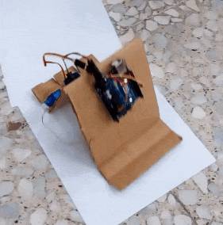
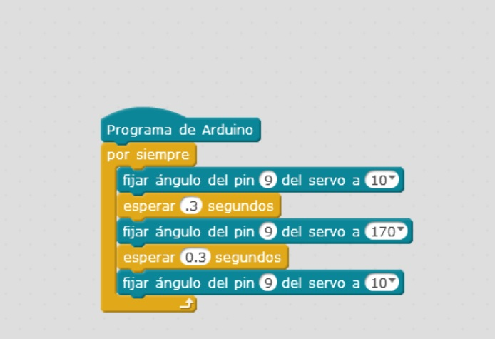

# Título de la práctica

Descripción de la práctica

## Materiales

- 1 Arduino
- 1 Servomotor
- 1 Clip de 9 v. con conector de alimentación para arduino
- 1 pila de 9 v.
- 3 Cables de puente macho a macho para arduino
- 1 Clip grande
- 1 Cartón corrugado de 36 x 12 cm 

## Esquema eléctrico

El servomotor dispone de tres cables: dos de alimentación (marrón = GND, rojo = VCC) y uno de señal (naranja = pin 9 de Arduino).
Enganchar el clip abierto al cartón de delante y al aspa del servomotor, que irá situado detrás, al borde del cartón. 
La placa Arduino va situada delante arriba, y su alimentación detrás abajo.

## Programación

